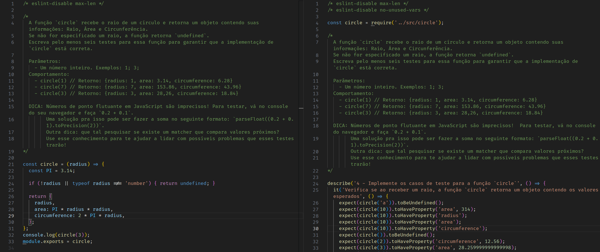

# README: Library organization



## Project Description

In this project, various functions and their respective tests were developed. The goal is to continue improving my skill with higher-order functions (HoFs) and Jest.

### Technologies

- LINUX
- VSCODE
- JAVASCRIPT
- JEST

### What I Learned

- How to use object entries, keys and values
- How to write more robust tests

## How to Run the Project

1. Clone the repository:

   ```bash
   git clone https://github.com/feduarte-dev/js-unit-tests
   ```

2. Navigate to the project directory:

   ```bash
   cd your-repository
   ```

3. Install dependencies:

   ```bash
   npm install
   ```

4. Test the application:

   ```bash
   npm run test
   ```

## Contributions

[Felipe](https://www.linkedin.com/in/feduarte-dev/) - /src - /tests


[Trybe](https://www.betrybe.com/) - Everything else
